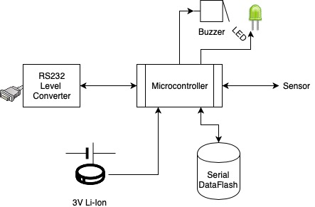
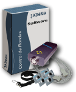

#   JADEKU - ADQ128 
## Portable Low-Power Data Acquisition Device 

### Description

This device is a low power microcontroller design, it has a serial data flash for data storage,
serial port communication interface, and an iButton 1-wire bus for data capture.
The main constrain was overall cost, ex. note the RTC implementation is done using microcontroller resources.
Basically we have a battery power, handheld device with storage up to 1Mb, RTC, 1-wire bus and serial connection 
for setup and data download.  The main application use case is a Watchman's clock; each station or check point for the routine
check has an iButton, DS1990 chip, it returns a uniquie electronic serial number,  the device stores it with the event's time.
When a person decides, ex. Supervisor/Manager, she can download the data stored to a PC, then she is able to do audits, 
check events, hours and station/point. 

### Design

Hardware block diagram:

#### Embedded Software

[Doxygen documentation](https://hemonserrat.github.io/jadeku/)

| IDE:| MPLAB X IDE v5.25 |
| ------------------------------------------------------------ | ---- |
| Compiler:| XC8 v1.41 | 

See folders:  
[inc](inc/)  
[src](src/)

#### EDA: Schematics and PCB
 [EDA design PDF](hardware/0472-Jadeku2/JADEKU.pdf)

Source files inside [ECAD folder](hardware/0472-Jadeku2/)  
CAM [Gerbers folder](hardware/CAM)

#### CAD: Case V1

  
[CAD files](hardware/case)

- - - 
- Commercial use case:  Watchman's clock  (routine control)

|                           | Complete kit, including wall mount points, DS1990 iButtons, serial cable and PC Software      |
| ------------------------------------------------------------ | ---- |
|  | The device with its ruged metal case.|
|  | Security guard/Watchman check in at an station point   |
|  | Handheld portable device  |
|  |  Dallas DS1990 1-wire check in station/point |

(C) 2004-2005,  Hernan Monserrat, License GNU GPL 3  
 

